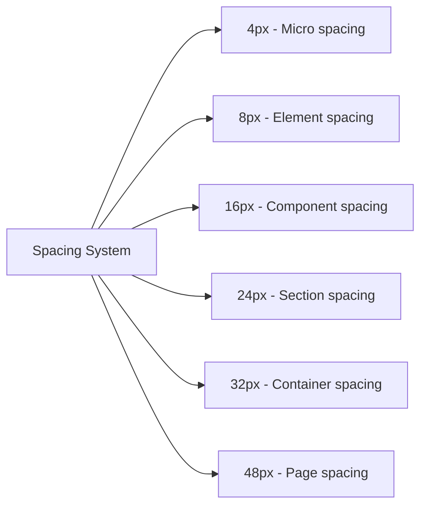

# Comprehensive UI/UX Redesign Plan for KwikPartner

Based on the GoKwik design language shown in the reference images, this document outlines a detailed plan to transform KwikPartner into a modern, dimensional interface with elevated components and thoughtful interactions.

## 1. Color Palette & Design System

```mermaid
graph TD
    A[Primary Colors] --> B[Deep Blue #003c71]
    A --> C[Teal Accent #00BFA6]
    A --> D[White #FFFFFF]

    E[Secondary Colors] --> F[Light Blue #f5f8ff]
    E --> G[Success Green #52c41a]
    E --> H[Warning Orange #faad14]
    E --> I[Error Red #ff4d4f]

    J[Neutral Colors] --> K[Dark Text #333333]
    J --> L[Secondary Text #666666]
    J --> M[Tertiary Text #999999]
    J --> N[Border #e8e8e8]
    J --> O[Background #f8f9fa]

    P[Elevation System] --> Q[Level 1: 0 2px 8px rgba(0,0,0,0.08)]
    P --> R[Level 2: 0 4px 12px rgba(0,0,0,0.1)]
    P --> S[Level 3: 0 8px 24px rgba(0,0,0,0.12)]
    P --> T[Level 4: 0 12px 32px rgba(0,0,0,0.16)]
```

## 2. Typography System

- **Primary Font**: Inter (with system fallbacks)
- **Heading Sizes**:
  - H1: 32px/40px, 700 weight
  - H2: 24px/32px, 700 weight
  - H3: 20px/28px, 600 weight
  - H4: 18px/24px, 600 weight
  - H5: 16px/24px, 600 weight
- **Body Text**:
  - Regular: 14px/22px, 400 weight
  - Small: 12px/18px, 400 weight
- **Special Text**:
  - Statistic Values: 28px/36px, 600 weight
  - Labels: 12px/16px, 500 weight, uppercase tracking

## 3. Elevated Card Components

The core of our redesign will feature dimensional cards that appear to float above the background:

### 3.1 Card Elevation Levels

1. **Level 1 (Default)**:

   - Box shadow: `0 2px 8px rgba(0,0,0,0.08)`
   - Border radius: 12px
   - Background: White
   - Border: None

2. **Level 2 (Highlighted)**:

   - Box shadow: `0 4px 12px rgba(0,0,0,0.1)`
   - Border radius: 12px
   - Background: White
   - Border: None
   - Transform: `translateY(-2px)` on hover

3. **Level 3 (Modal/Drawer)**:

   - Box shadow: `0 8px 24px rgba(0,0,0,0.12)`
   - Border radius: 16px
   - Background: White
   - Border: None

4. **Level 4 (Floating Action)**:
   - Box shadow: `0 12px 32px rgba(0,0,0,0.16)`
   - Border radius: 24px
   - Background: Gradient or solid
   - Transform: `scale(1.05)` on hover

### 3.2 Card Interaction States

- **Rest**: Default elevation
- **Hover**: Subtle lift (transform: translateY(-2px)) with increased shadow
- **Active/Selected**: Slight depression (transform: translateY(1px)) with highlight border
- **Disabled**: Reduced opacity (0.6) with grayscale filter

## 4. Layout & Spacing System



- **Grid System**: 24-column fluid grid with responsive breakpoints
- **Content Width**: Max-width 1440px centered
- **Gutters**: 24px between columns
- **White Space**: Generous padding (24px) around content areas
- **Section Separation**: 32px vertical spacing between major sections

## 5. Component Redesign Specifications

### 5.1 Sidebar Navigation

- Deep blue background (#1a3a7e)
- White text with hover state in teal
- Selected item with teal accent and subtle background
- Icon + text alignment with proper spacing
- Collapsible with smooth animation
- User profile section at bottom
- Subtle separator lines between sections

### 5.2 Dashboard Cards

- Elevated appearance (Level 2)
- Clear headings with 16px top/bottom padding
- Content area with 24px padding
- Subtle hover effect with shadow increase
- Optional accent border-left for categorization
- Consistent height within rows when possible
- Responsive behavior (stack on mobile)

### 5.3 Statistic Cards

- Large, prominent numbers (28px, 600 weight)
- Secondary label text (14px, 400 weight)
- Visual indicator for trends (up/down arrows)
- Color-coded values based on context
- Optional icon aligned with title
- Hover state reveals additional context
- Animation for value changes

### 5.4 Data Tables

- Clean, borderless design
- Alternating row colors (white/#f9f9f9)
- Sticky headers with subtle background
- Row hover state with teal highlight
- Pagination controls with clear styling
- Sortable columns with visual indicators
- Responsive behavior (horizontal scroll on mobile)

### 5.5 Forms & Inputs

- Floating labels that animate on focus
- Clear focus states with teal outline
- Validation states with appropriate colors
- Helper text with proper spacing
- Consistent height for all input types
- Custom select and checkbox styling
- Touch-friendly sizing (min 44px tap targets)

## 6. Micro-Interactions & Animation

- **Card Hover**: Subtle elevation increase (transform: translateY(-2px)) with shadow enhancement
- **Button Hover**: Slight scale increase (1.02) with color shift
- **Form Focus**: Label animation and border highlight
- **Navigation Transitions**: Smooth slide animations between pages (300ms)
- **Data Loading**: Skeleton screens instead of spinners
- **Notifications**: Slide-in with subtle bounce effect
- **Charts**: Progressive reveal of data points
- **Success States**: Checkmark animation with ripple effect

## 7. Implementation Plan

### Phase 1: Foundation

1. Create theme configuration file with color palette, typography, and spacing
2. Implement global CSS with variables and utility classes
3. Build core component library (cards, buttons, inputs)
4. Update layout components (sidebar, header, page container)

### Phase 2: Component Enhancement

1. Redesign dashboard cards with elevation system
2. Implement statistic cards with animations
3. Update data tables with new styling
4. Enhance form components with micro-interactions
5. Create chart components with consistent styling

### Phase 3: Page Refinement

1. Apply new design to Dashboard page
2. Update Partner-specific pages (Referral, Reseller, Service)
3. Enhance modal and drawer components
4. Implement responsive adjustments
5. Add page transitions and animations

### Phase 4: Polish & Optimization

1. Conduct usability testing
2. Refine interactions based on feedback
3. Optimize performance (reduce animation on low-power mode)
4. Ensure accessibility compliance
5. Create documentation for design system

## 8. Technical Implementation Details

### CSS Approach

```css
:root {
  /* Color Variables */
  --color-primary: #1a3a7e;
  --color-accent: #00bfa6;
  --color-background: #f8f9fa;
  --color-card: #ffffff;

  /* Elevation Variables */
  --shadow-level1: 0 2px 8px rgba(0, 0, 0, 0.08);
  --shadow-level2: 0 4px 12px rgba(0, 0, 0, 0.1);
  --shadow-level3: 0 8px 24px rgba(0, 0, 0, 0.12);
  --shadow-level4: 0 12px 32px rgba(0, 0, 0, 0.16);

  /* Animation Variables */
  --transition-fast: 150ms ease;
  --transition-normal: 300ms ease;
  --transition-slow: 500ms ease;
}

/* Card Component Example */
.card {
  background-color: var(--color-card);
  border-radius: 12px;
  box-shadow: var(--shadow-level1);
  transition: transform var(--transition-normal), box-shadow var(--transition-normal);
}

.card:hover {
  transform: translateY(-2px);
  box-shadow: var(--shadow-level2);
}

/* Elevated Card Example */
.card-elevated {
  background-color: var(--color-card);
  border-radius: 12px;
  box-shadow: var(--shadow-level2);
  transform: translateY(-2px);
}
```

### React Component Structure

```jsx
// DashboardCard.tsx
const DashboardCard = ({ title, children, elevation = 1, hoverable = true, className, ...props }) => {
  const shadowClass = `shadow-level${elevation}`;
  const hoverClass = hoverable ? 'hover:shadow-level2 hover:-translate-y-1' : '';

  return (
    <div className={`card ${shadowClass} ${hoverClass} ${className}`} {...props}>
      {title && <div className='card-header'>{title}</div>}
      <div className='card-body'>{children}</div>
    </div>
  );
};
```

## 9. Visual Examples

Based on the GoKwik reference images, the KwikPartner redesign will feature:

1. **Sidebar**: Deep blue with clear hierarchy and selected state indicators
2. **Dashboard**: Clean white cards with subtle shadows and clear data visualization
3. **Forms**: Structured layouts with ample spacing and clear input states
4. **Tables**: Clean, scannable data with proper alignment and visual hierarchy
5. **Modals**: Elevated appearance with focused content and clear actions

## 10. Next Steps

1. Review and approve the design system components
2. Prioritize pages for implementation
3. Create a component development roadmap
4. Establish animation and interaction guidelines
5. Develop a responsive strategy for mobile views

This comprehensive redesign will transform KwikPartner into a modern, dimensional interface that maintains the GoKwik brand identity while providing an enhanced user experience through thoughtful design, clear hierarchy, and delightful interactions.
