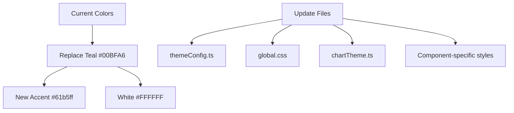
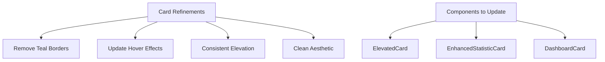
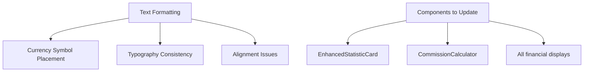
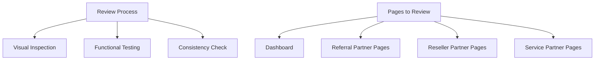

# Comprehensive UI/UX Refinement Plan

Based on your feedback, I've outlined a detailed plan to refine the design by replacing teal elements with #61b5ff or white, removing card borders, fixing formatting issues, and enhancing the overall user experience.

## 1. Color Palette Updates

### Implementation Details:

1. **Update Theme Configuration**

   - Replace teal accent color (#00BFA6) with light blue (#61b5ff)
   - Update all references to teal in the theme configuration
   - Ensure primary color remains #003c71 for navbar and buttons

2. **Update Global CSS**

   - Replace all teal color variables with light blue
   - Update hover states, selected states, and accent colors
   - Remove teal border-left from card styles

3. **Update Chart Colors**
   - Replace teal with light blue in chart color palette
   - Ensure consistent color usage across all visualizations

## 2. Card Design Refinements

### Implementation Details:

1. **Update ElevatedCard Component**

   - Remove the accentColor property or change its default to null
   - Update the component to not add a left border by default
   - Enhance hover effects for a cleaner aesthetic

2. **Update Card Usage Throughout Application**
   - Remove accentColor prop from all card instances
   - Ensure consistent elevation levels for visual hierarchy
   - Apply clean, borderless design across all pages

## 3. Text Formatting and Symbol Placement

### Implementation Details:

1. **Fix Currency Symbol Placement**

   - Update EnhancedStatisticCard to place ₹ before numbers
   - Review all financial displays to ensure consistent symbol placement
   - Create a utility function for formatting currency values

2. **Typography Consistency**
   - Ensure consistent font sizes, weights, and colors
   - Apply proper spacing between text elements
   - Fix any alignment issues in text displays

## 4. Comprehensive Review and Refinement

### Implementation Details:

1. **Visual Inspection**

   - Review all pages for visual consistency
   - Identify and fix any alignment issues
   - Ensure proper spacing between elements

2. **Functional Testing**

   - Test all interactive elements with the new styling
   - Ensure hover states and animations work correctly
   - Verify that all components render correctly

3. **Additional Refinements**
   - Enhance form elements for better usability
   - Improve table designs for better readability
   - Add subtle animations for better user feedback

## 5. Implementation Plan

1. **Phase 1: Core Updates**

   - Update theme configuration files
   - Update global CSS variables
   - Modify core components (ElevatedCard, EnhancedStatisticCard)

2. **Phase 2: Page-by-Page Refinement**

   - Update Dashboard page
   - Update Referral Partner pages
   - Update Reseller Partner pages
   - Update Service Partner pages

3. **Phase 3: Testing and Polishing**
   - Conduct browser-based testing
   - Fix any remaining issues
   - Apply final polish to the interface

## 6. Specific Code Changes

Here are the specific files that need to be updated:

1. `src/theme/themeConfig.ts`

   - Replace teal accent color with light blue
   - Update component styles

2. `src/styles/global.css`

   - Update color variables
   - Remove teal borders
   - Update hover and active states

3. `src/components/common/ElevatedCard.tsx`

   - Remove or modify accentColor property
   - Update card styling

4. `src/components/common/EnhancedStatisticCard.tsx`

   - Update currency symbol placement
   - Update styling

5. All page components
   - Remove accentColor props from cards
   - Fix any alignment issues
   - Ensure consistent styling
